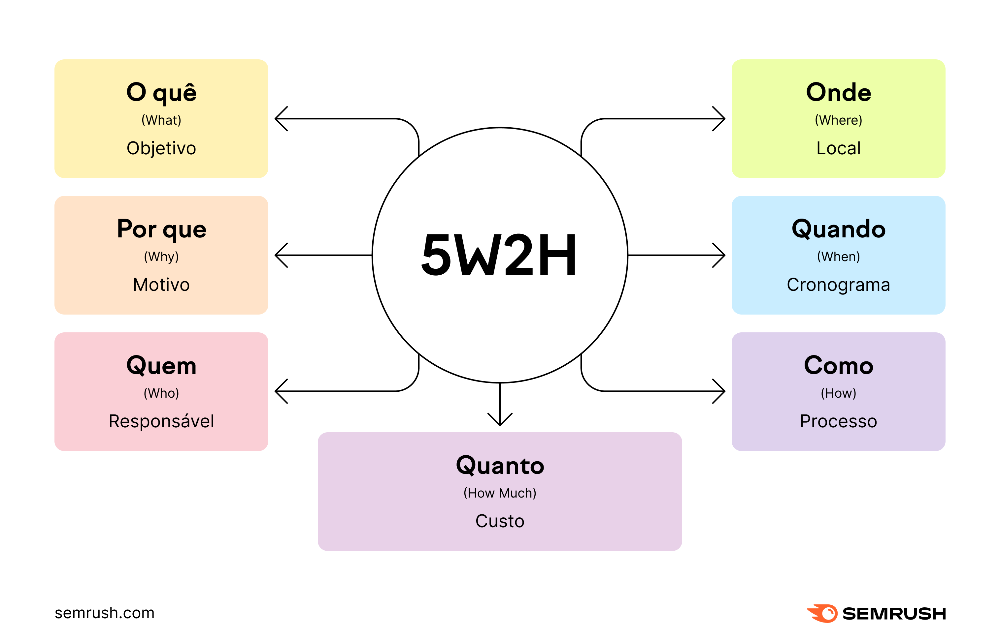

# 5W2H

## Introdução
O 5W2H é uma ferramenta administrativa  que pode ser utilizada para diferentes contextos dentro de uma organização, como na organização para planejamento estratégico e guia na execução de ações. O 5W2H baseia-se em 7 perguntas (What?, Why?, Where?, Who?, When?, How? e How much?), com o intuito de esclarecer e organizar ideias. A ferramenta será utilizada como um guia de ações, tornando os objetivos mais evidentes para a equipe, auxiliando na compreensão, organização e tomadas de decisões no projeto.

## Metodologia
A equipe se reuniu para esclarecimento sobre o tema do projeto, a partir dos pontos debatidos foi possível responder às questões do 5W2H.

## Questões 5W2H

### Versão 1.0

#### Visão geral

| Questão | Resposta |
|---------|----------|
| What?(O que deve será feito?) | O projeto visa desenvolver uma plataforma digital para facilitar as entregas de alimentos na Ilha Primeira, no Rio de Janeiro. Isso incluirá o desenvolvimento de um site ou aplicativo de delivery, focado em melhorar a comunicação entre moradores e entregadores, otimizar o transporte de alimentos e garantir uma gestão eficiente dos pedidos. |
| Why? (Por que isso será feito?) | Este projeto é necessário devido ao problema enfrentado pelos moradores da Ilha Primeira, que não têm acesso a serviços de entrega tradicionais por conta da falta de acesso terrestre. A solução proposta busca melhorar a viabilidade das entregas de alimentos na região e promover um serviço sustentável e acessível para a comunidade local. A falta de opções viáveis, como o contêiner de alto custo e a desativação do ponto de apoio anterior, reforça a necessidade urgente de uma solução digital mais eficiente e acessível. |
| Where? (Onde será feito?) | O trabalho será realizado na Faculdade e Home Office. |
| When? (Quando será feito?) | Durante o semestre de 2025.1. |
| Who? (Quem irá fazer?) | A equipe é formada pelos alunos Viktor Mayer Berruezo, Gabriel Couto Barros, Tiago Oliveira Macedo, Diego Gode Bonani e Daniel de Jesus Teixeira. |
| How? (Como será feito?) | Utilizando metodologia RUP/UP e ferramentas como Visual Code Studio e Django. |
| How much? (Quanto custará?) | O custo do projeto será o tempo e esforço da equipe para o desenvolvimento da aplicação. |

### Versão 2.0

#### Visão produto

| Questão | Resposta |
|---------|----------|
| What?(O que deve será feito?) | Um aplicativo web para delivery na Ilha Primeira **Gerência de Ilha Delivery** |
| Why? (Por que isso será feito?) | Para auxiliar aos moradores em relação a entrega e recebimento de produtos |
| Where? (Onde será feito?) | Será desenvolvido em sala de aula do Ibmec - Barra |
| When? (Quando será feito?) | Será desenvolvido durante o primeiro semestre de 2025.1 |
| Who? (Quem irá fazer?) | Gabriel Couto, Daniel Teixeira, Viktor Mayer, Diego Gode e Tiago Oliveira |
| How? (Como será feito?) | Utilizando metodologia RUP/UP, conhecimentos de Programação orientada a objetos e Engenharia de dados, e ferramentas como Visual Code Studio e Django. |
| How much? (Quanto custará?) | O custo do projeto será o tempo e esforço da equipe para o desenvolvimento da aplicação. |

## Conclusão

O 5W2H é um técnica bem simples e de fácil entendimento, sem a necessidade de um especialista. Dentro da disciplina a técnica fornece um entendimento melhor, para a equipe, sobre o projeto como responsabilidades, motivação e organização de ações.

## Referências Bibliográficas

> 5W2H: disponível em:  
>   
> O que é 5W2H, disponível em: https://statorials.org/pt/5w2h/

## Autor(es)

| Data      | Versão | Descrição                | Autor(es)                |
|-----------|--------|--------------------------|--------------------------|
| 26/03/25  | 1.0    | Criação do documento     | Gabriel Couto Barros     |
| 26/03/25  | 2.0    | Adicionada bibliografia  | Daniel de Jesus Teixeira |
| 26/03/25  | 3.0    | Adicionada visão produto | Diego Gode Bonani        |
